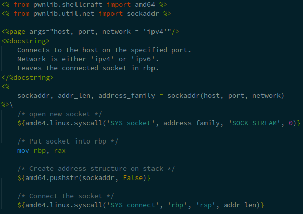

# Pwntools Mako Assembly Syntax Highlighting

This should work for TextMate and anything that's compatible (e.g. Sublime Text).

## Installation

### Sublime Text

Copy the `tmLanguage` files into the `Packages/User` folder in your Sublime Text configuration folder.  

These folders are located at the paths shown below.  Replace `2` with `3` if you're a ST3 user.

- OS X: `~/Library/Application Support/Sublime Text 2`
- Windows: `%APPDATA%\Sublime Text 2`
- Linux: `~/.config/sublime-text-2`

Open a `.asm` file, and choose `View > Syntax > Open All ... > Pwntools ...`.
